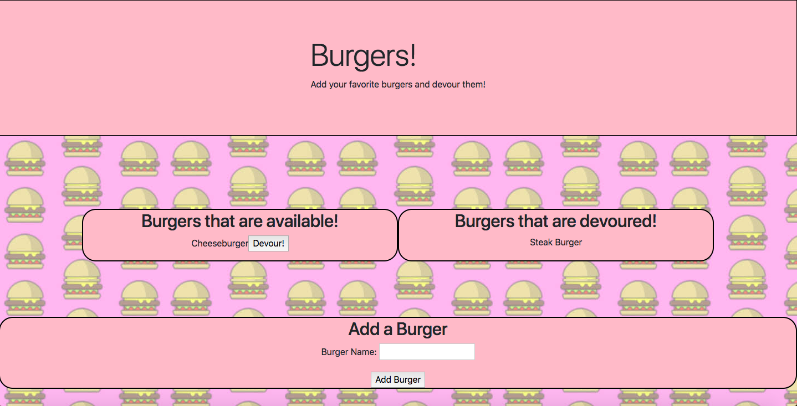

# Eat-Da-Burger

Heroku App URL: https://eat-your-burger.herokuapp.com/

## Overview

This is a school assignment that utilizes handlebars, the concept of MVC, and uses ORM with MySQL. The user can add a name of a burger(Or any word) and places it under the "Burgers that are available!" section. 

User can click the "Devour" button next to the burger name and place it under the "Burgers that are devoured!" section. 





## Instructions

You can click on the Heroku URL above to test it out. If you wish to test this repo out on your local computer, please make sure to add the `schema.sql` and the `seeds.sql` to your relational database management system. 

You must also change the credentials in the `connection.js` file: 

```
var connection = mysql.createConnection(
    process.env.JAWSDB_URL || {
        host: process.env.MYSQL_HOST || "***INSERT HOST NAME***",
        port: process.env.MYSQL_PORT || ***INSERT PORT NUMBER**,
        user: process.env.MYSQL_USER || "***INSERT USER***",
        password: process.env.MYSQL_SECRET || "***INSERT PASSWORD***",
        database: process.env.MYSQL_DB || "burgers_db"
    }
);
```
